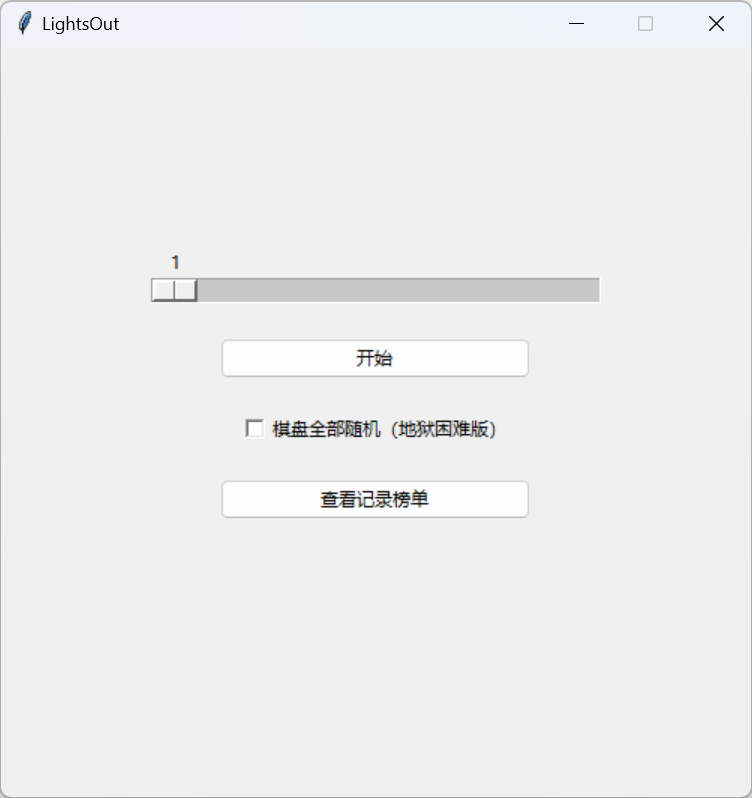

# LightsOut
An common game but in python use tkinter and numpy array. 
一个常见的游戏。它运行在python环境下，使用numpy数组。

## Operation method  操作方法
When you open program,It will show a window like this: 
当运行程序后，会显示窗口： 

 (program version 1.0,without translate) (1.0版本，没翻译) 
You can change gameboard's side length from the scale. 
您可以通过最上方的拖拽条更改棋盘的边长。

## Play method  玩法
When you click a block,the block around what you click will change state.The opened ones will be close,The closed ones will be open. 
当您点击方块时，方块和它周围的方块全都会开变成关，关变成开。  
The game will win when all the blocks are lit up. 
当所有灯被打开，游戏将胜利。

## Note 后记
This program is coded by Python 3.11,but packaged by Python 3.8,so it can run on Windows 7. 
程序由python3.11编写，但由python3.8打包，所以它可以在win7上运行。  
The Author will translate this program in the future. 
作者将会翻译更多语言。
